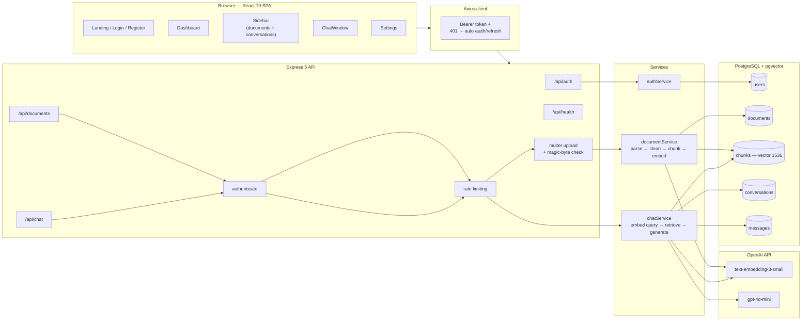

# Cognidex


Upload a PDF, ask it questions, get answers grounded in the document with citations back to the exact chunks used — not a wrapper around a general chatbot. Cognidex is a full-stack Retrieval-Augmented Generation (RAG) application: real text extraction, real chunking and embedding, real vector similarity search, with per-user and per-document data isolation enforced at the database query level.

## Overview

- Upload a PDF → it's parsed, cleaned, split into overlapping chunks, embedded, and stored with a vector index.
- Ask a question in a per-document conversation → the question is embedded, matched against that document's chunks by cosine similarity (with a relevance cutoff, not just "top 5 regardless of quality"), and the retrieved passages are sent to an LLM alongside recent conversation history for follow-up questions.
- Every answer returns its source chunks, shown in the UI as collapsible citations.
- Every document/chunk/conversation/message query is scoped to `owner_id` (and `document_id` where relevant) at the SQL level — one user's documents and conversations are never visible to another user, and this is covered by an automated test suite, not just an assumption.

## Architecture



Every arrow into Postgres from `chatService`/`documentService` passes through a model function that filters by the requesting user's `owner_id` — see [`tests/models/`](backend/tests/models) for tests that assert this directly against the SQL sent to the database.

## Features

- Email/password auth with JWT access tokens (15m) + httpOnly refresh cookie (7d), automatic silent refresh on the frontend
- PDF upload with real magic-byte validation (not just a trusted `Content-Type` header)
- Automatic parsing → chunking → embedding → indexing, with live status (`pending` → `processing` → `indexed`/`failed`)
- Per-document conversations with persisted message history
- Retrieval-grounded answers with a relevance threshold (irrelevant questions correctly return "no relevant information" instead of a shaky guess)
- Multi-turn context — follow-up questions understand what was asked/answered earlier in the conversation
- Source citations per answer, shown as collapsible chunk references in the UI
- Rate limiting on auth, chat, and upload routes
- Account settings (update display name), landing page, protected routing
- Health-check endpoint + scheduled keep-alive workflow for free-tier hosting (Render/Supabase)

## Tech Stack

| Layer | Technology |
|---|---|
| Frontend | React 19, Vite, React Router 7, Tailwind CSS 4, Axios |
| Backend | Node.js, Express 5, TypeScript (strict mode) |
| Database | PostgreSQL + [pgvector](https://github.com/pgvector/pgvector) |
| Auth | JWT (`jsonwebtoken`), `bcrypt` password hashing |
| AI | OpenAI `text-embedding-3-small` (embeddings), `gpt-4o-mini` (generation) |
| File handling | `multer` (memory storage), `pdf-parse` |
| Testing | Vitest |
| CI | GitHub Actions (type-check, lint, test, build on every push/PR) |
| Deployment | Render (backend), Vercel (frontend), Supabase (Postgres) |

## RAG Pipeline

1. **Upload** — PDF arrives as a multipart file, capped at 10MB, validated by both MIME type and actual magic bytes (`%PDF-`).
2. **Parse** — `pdf-parse` extracts raw text; control characters are stripped and whitespace is normalized.
3. **Chunk** — fixed-size character chunks (500 chars, 50 char overlap) via a plain, independently unit-tested `chunkText` function.
4. **Embed** — each chunk is embedded with `text-embedding-3-small` and stored in a `vector(1536)` column.
5. **Query** — a regex heuristic decides between two retrieval strategies:
   - **Similarity search** for targeted questions — the query is embedded, matched by cosine distance (`pgvector`'s `<=>` operator), filtered by a distance cutoff so irrelevant chunks are excluded rather than padded in, and capped at the top 5.
   - **Full-document pull** for "summarize/list/extract"-style questions, capped at 80 chunks to bound cost on large documents.
6. **Generate** — retrieved chunks + the last 6 messages of conversation history are sent to `gpt-4o-mini` with a system prompt that restricts answers to the provided context, instructs the model to treat document content as data (not instructions — basic prompt-injection hardening), and gives an explicit refusal string when the answer isn't in the document.
7. **Respond** — the answer and its source chunks (document name + chunk index) are returned together and rendered in the chat UI.

## Getting Started

### Prerequisites

- Node.js 20+
- A PostgreSQL database with the `pgvector` extension available (the migration will attempt `CREATE EXTENSION IF NOT EXISTS vector` on your behalf)
- An OpenAI API key

### Setup

```bash
git clone https://github.com/Krishal-D/cognidex-ai.git
cd cognidex-ai

cd backend
cp .env.example .env   # fill in DATABASE_URL and OPENAI_API_KEY — see below
npm install
npm run migrate
npm run dev             # http://localhost:5000

cd ../frontend
cp .env.example .env
npm install
npm run dev              # http://localhost:5173
```

### Environment Variables

**`backend/.env`** (see [`backend/.env.example`](backend/.env.example)):

| Variable | Description |
|---|---|
| `PORT` | Port the API listens on (default `5000`) |
| `NODE_ENV` | `development` or `production` |
| `CLIENT_URL` | Frontend origin, for CORS and cookie behavior |
| `DATABASE_URL` | PostgreSQL connection string |
| `JWT_SECRET` / `JWT_REFRESH_SECRET` | Long, random, distinct signing secrets |
| `OPENAI_API_KEY` | Used for both embeddings and chat completion |

**`frontend/.env`** (see [`frontend/.env.example`](frontend/.env.example)):

| Variable | Description |
|---|---|
| `VITE_API_URL` | Base URL of the backend API (no `/api` suffix) |

The app fails fast with a clear error message at startup if a required backend variable is missing, instead of failing later with a cryptic error.

## Testing

```bash
cd backend
npm test
```

73 tests across pure utility functions, JWT/password logic, the database model layer, and service-layer business logic. The model-layer and service-layer tests mock the database/model layer respectively and assert directly on the SQL/parameters sent — in particular, they prove that retrieval and deletion are always scoped to the requesting user's own data, and include a regression test for a conversation-deletion bug caught and fixed during development (see `tests/models/chatModel.test.ts`).

CI (`.github/workflows/ci.yml`) runs type-checking, linting, the test suite, and a production build on every push and pull request to `main`.

## Project Structure

```
backend/
  src/
    config/       env validation, JWT/bcrypt helpers, DB pool
    controllers/   thin HTTP layer
    services/      validation + business logic
    models/        parameterized SQL queries
    middleware/    auth, rate limiting, upload handling, error handling
    migrations/     idempotent schema setup, run via `npm run migrate`
    utils/          chunking, embeddings, generation, file validation
  tests/           mirrors src/, one test file per module

frontend/
  src/
    pages/          Landing, Login, Register, Dashboard, Settings
    components/     chat/ (window, bubbles, citations), layouts/, ui/
    hooks/          data-fetching hooks per resource
    api/            typed Axios wrappers per resource
    context/        auth state
```

## API Overview

| Method | Route | Description |
|---|---|---|
| `POST` | `/api/auth/register`, `/login`, `/logout`, `/refresh` | Auth flow |
| `PUT` | `/api/auth/me` | Update display name |
| `POST` | `/api/documents/upload` | Upload + index a PDF |
| `GET` / `DELETE` | `/api/documents`, `/api/documents/:id` | List / delete documents |
| `POST` | `/api/chat/conversations` | Start a conversation on a document |
| `POST` | `/api/chat/conversations/:id/query` | Ask a question, get a grounded answer + sources |
| `GET` / `PUT` / `DELETE` | `/api/chat/conversations/:id` | Fetch / rename / delete a conversation |
| `GET` | `/api/health` | Liveness + DB check (used by the keep-alive workflow) |

All routes above `/auth/register`, `/login`, `/logout`, `/refresh`, and `/health` require a Bearer token.

## Known Limitations

Being upfront about what this project doesn't do yet:

- **Document indexing is synchronous** — a large PDF holds the upload request open for the full parse/chunk/embed pipeline; there's no background job queue.
- **Citations reference chunk index, not page number** — page boundaries are lost during text cleanup before chunking.
- **No re-ranking** beyond the cosine-distance cutoff and top-K limit.
- **Single active session per user** — logging in on a new device invalidates the previous device's refresh token.
- **No password-reset flow.**
- **Uploads aren't scanned for malicious content** beyond the magic-byte format check — that stops MIME-spoofing, not a maliciously crafted PDF exploiting a parser bug.

## License

ISC
